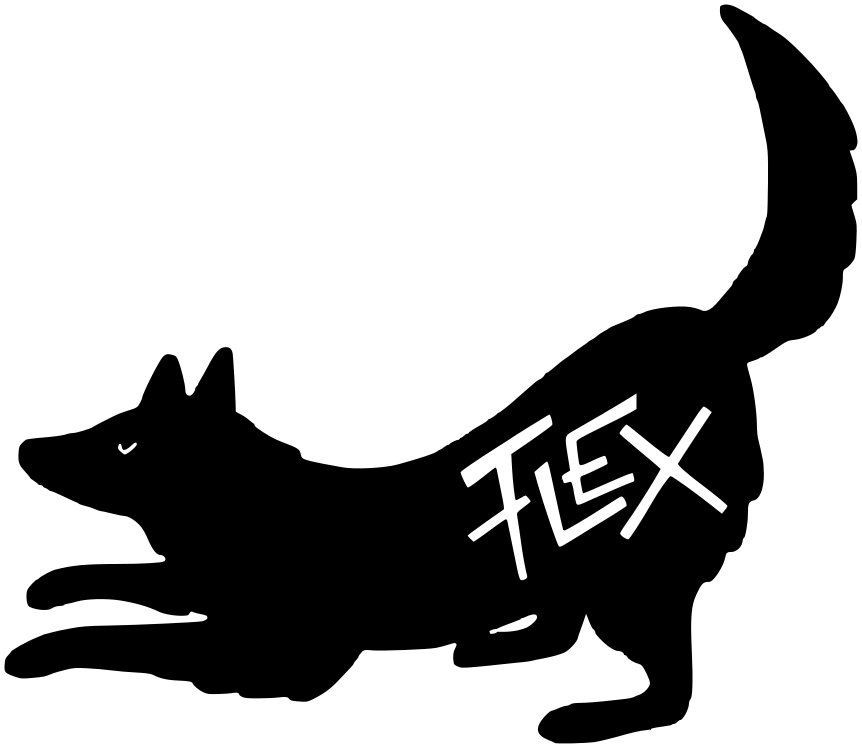

# flex

<p align="center">
        
        <br>
        <a href="https://github.com/go-flexible/flex/actions/workflows/go.yml">
                
        </a>
        <a href="https://pkg.go.dev/github.com/go-flexible/flex"></a>
</p>

A collection of packages for building Go services.

## Quick Start

Below is an example for how to get running quickly.  
This code can be found in the examples folder.

```go
package main

import (
 "context"
 "fmt"
 "log"
 "net/http"

 "github.com/go-flexible/flex"
)

func main() {
        router := http.NewServeMux()
        router.HandleFunc("/", func(rw http.ResponseWriter, r *http.Request) {
                fmt.Fprint(rw, "hello, world\n")
        })

        srv := &http.Server{
                Addr:    ":8080",
                Handler: router,
        }

        flex.MustStart(
                context.Background(),
                NewHTTPServer(srv),
        )
}

// TODO: this functionality should be provided by a plugin.
// for now this is an example on how to implement our interfaces.
type Server struct{ *http.Server }

func NewHTTPServer(s *http.Server) *Server {
        return &Server{Server: s}
}

func (s *Server) Run(_ context.Context) error {
        log.Printf("serving on: http://localhost%s\n", s.Addr)
        return s.ListenAndServe()
}

func (s *Server) Halt(ctx context.Context) error {
        return s.Shutdown(ctx)
}
```

## Contributors

Contributors listed in alphabetical order.

- [Ben Cable](https://github.com/ladydascalie): Author & Maintainer
- [Zee Philip Vieira](https://github.com/zeeraw): Author & Maintainer
